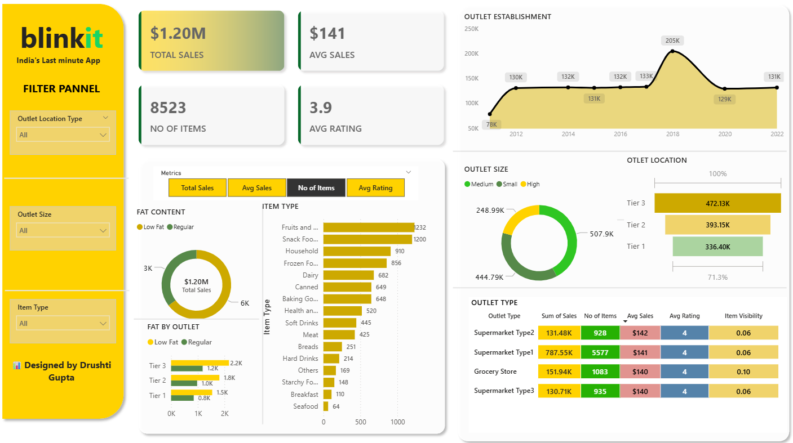

# 📊 Blinkit Sales Analysis Dashboard

## 📌 About the Project

This project presents a **Power BI dashboard** designed to analyze and visualize **Blinkit’s product sales performance**. It provides clear insights into sales trends, outlet performance, product categories, and customer preferences. The dashboard is interactive, allowing users to filter data by **outlet location, outlet size, and item type** for deeper analysis.

The primary goal of this project is to showcase how **business intelligence tools like Power BI** can transform raw sales data into meaningful insights for decision-making.

---

## 🎯 Key Features

* **Total Sales & Revenue Tracking** → Overview of overall sales performance.
* **Average Sales & Ratings** → Quick KPIs for measuring product performance.
* **Outlet Establishment Trends** → Sales over time to analyze growth patterns.
* **Item Type Performance** → Identifies top-selling categories like snacks, household, and dairy.
* **Fat Content Analysis** → Comparison of sales between low-fat and regular items.
* **Outlet Size & Location Analysis** → Visual breakdown by Tier 1, Tier 2, and Tier 3 outlets.
* **Outlet Type Insights** → Performance comparison of different outlet types (Supermarkets, Grocery Stores, etc.).
* **Interactive Filters** → Dynamic filtering by outlet size, location type, and item type.

---

## 🛠 Tools & Technologies

* **Power BI** – For building the interactive dashboard.
* **Data Cleaning & Processing** – Performed within Power BI (Power Query).
* **Dataset** – Blinkit product sales dataset (containing outlet, product, and sales information).

---

## 📷 Dashboard Preview

---

## 🚀 How to Use

1. Clone the repository.
2. Open the `.pbix` file in **Power BI Desktop**.
3. Explore the dashboard with available filters and visuals.

---

## 📈 Insights from the Dashboard

* Tier 3 outlets generated the **highest sales** compared to Tier 1 and Tier 2.
* **Regular fat products** performed better than low-fat items.
* **Supermarket Type 1** contributed the largest share of sales.
* Peak establishment sales were observed around **2018**.

---

## 📌 Conclusion

This project demonstrates the power of **data visualization and BI tools** in understanding business performance. Such dashboards help businesses like Blinkit in **tracking KPIs, identifying top-performing products, and making data-driven decisions**.

---

👉 Would you like me to also make a **short professional tagline (1–2 lines)** for the top of your README, so it instantly catches attention for recruiters?
